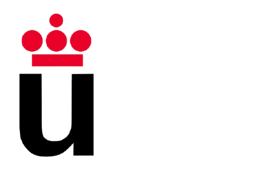

# URJC Bank

<h2>Index</h2>

- [A brief introduction](#intro)
- [Our development team](#dev_team)
- [Web features](#web_features)
    - [Entities](#web_entities)
    - [User permissions](#web_permissons)
    - [Images](#web_images)
    - [Charts](#web_charts)
    - [Complementary technology](#web_comp_tech)
    - [Advanced algorithms](#web_algos)
- [Extra information](#extra_info)

 

<h2 id="intro">📖 A brief introduction 📖</h2>
<h3>What is URJC Online Bank?</h3>

URJC Online Bank is a web application which allows their users to receive and tranfer funds, as well as to organize their customers' expenses.

 
<h2 id="dev_team">👩‍💻 Our development team 👨‍💻</h2>

| Member | Mail | Git username |
|:-:|:-:|:-:|
|Cristian Andrei Vlad|ca.vlad.2021@alumnos.urjc.es|[Cristian1A](https://github.com/Cristian1A)|
|David Cereceda Catalán|d.cereceda.2021@alumnos.urjc.es| [DavidCCGithubURJC](https://github.com/https://github.com/DavidCCGithubURJC)|
|Julio del Junco Prieto|j.deljunco.2021@alumnos.urjc.es|[JuliodelJunco](https://github.com/JuliodelJunco)|
|Sergio Lopez Cuesta|s.lopezc.2018@alumnos.urjc.es|[sergio2000-hub](https://github.com/sergio2000-hub)|
|David Paúl Limaylla Ticlavilca|dp.limaylla.2021@alumnos.urjc.es|[DavidPaul-LT](https://github.com/DavidPaul-LT)|

 

<h2 id="web_features">💻 Web features 💻</h2>

<h3 id="web_entities">🤖 Entities</h3>

🔸 **Users**

Anonymous users, clients, manager.

🔸 **Account**

🔸 **Transfer**

🔸 **Charges**

 

Bank clients have accounts, which contains a list of transfers and charges.

<h3 id="web_permissons">🔐 User permissions</h3>

| Feature | Unregistered User | Bank client | Manager |
|:-:|:-:|:-:|:--|
|View information about offers, accounts and cards|✅|✅|✅|
|View relevant statistics about bank |✅|✅|✅|
|Ask for account creation|✅|❌|❌|
|Access the online banking tab|❌|✅|✅|
|Send and receive money|❌|✅|❌|
|Modify your profile|❌|✅|✅|
|View information about deposited and expended money|❌|✅|✅|
|Apply for a loan|❌|✅|❌|
|Approve the creation of an account|❌|❌|✅|
|Block access to an account or the funds in it|❌|❌|✅|

<h3 id="web_images">🖼️ Images</h3>

🔸 **Main page images**
        
🔸 **User profile pictures**    
    

🔸 **Charge type image**
    

<h3 id="web_charts">📊 Charts</h3>

🔸 **Income distribution chart**

This is a bar chart that indicates how much money has been deposited over a period of time.

🔸 **Spending distribution chart**

This is a pie chart that classifies all types of spending and indicates how much money a client spends in each cathegory.

<h3 id="web_comp_tech">🌐 Complementary technology</h3>

🔸 **map**

show location.

<h3 id="web_algos">🧠 Advanced algorithms</h3>

🔸 **Charge filter system**

An algorithm will be implemented to allow users to view their expenses filtered by the expense type.

 

<h2 id="extra_info">ℹ️ Extra information ℹ️</h2>

- [Trello](https://trello.com/b/PW1FfBkP/daw-grupo-4)

# PHASE 2

## Navigation

 

<h2 id="implementation_instructions">Implementation instructions</h2>

For linux distributions and Java version 17:

1. Clone the repository by typing in the command shell `git clone https://github.com/CodeURJC-DAW-2023-24/webapp04`
2. Create a database in MySQL called *urjc_bank*
3. Run BackendApplication's main function
4. Open `https://localhost:8443/` in any browser
 

## Diagram database

 

## Diagram entities

 

## Member participation

### David Cereceda Catalán
In this phase I have been mainly responsible for registering users and saving them in the database, for correcting things that were missing from the previous phase, and for helping with tasks that my colleagues were developing.

[Commit 1](https://github.com/CodeURJC-DAW-2023-24/webapp04/commit/f6ecaafe4bff220c3b386bf406786c87805affd8)

[Commit 2](https://github.com/CodeURJC-DAW-2023-24/webapp04/commit/f38515b384cad46d5ed837f424f9e4759881b5e6)

[Commit 3](https://github.com/CodeURJC-DAW-2023-24/webapp04/commit/c089d723c01f1a90b1815cf6f049d5af7366ea16)

[Commit 4](https://github.com/CodeURJC-DAW-2023-24/webapp04/commit/ed0b45cc0447288a4822ab04bd177740960be0f3)

[Commit 5](https://github.com/CodeURJC-DAW-2023-24/webapp04/commit/d76b21c8bba819a883002c57c349d98c8f1a838b)

[File 1](https://github.com/CodeURJC-DAW-2023-24/webapp04/blob/main/backend/src/main/java/webapp4/main/controller/AccountCreationController.java)

[File 2](https://github.com/CodeURJC-DAW-2023-24/webapp04/blob/main/backend/src/main/resources/templates/register_page.html)

[File 3](https://github.com/CodeURJC-DAW-2023-24/webapp04/blob/main/backend/src/main/java/webapp4/main/security/SecurityConfig.java)

[File 4](https://github.com/CodeURJC-DAW-2023-24/webapp04/blob/main/backend/src/main/resources/static/public/js/profile_ajax.js)

[File 5](https://github.com/CodeURJC-DAW-2023-24/webapp04/blob/main/backend/src/main/resources/templates/profile_page.html)
### Cristian Andrei Vlad
I was responsible for the database system with all the .csv, the AJAX part and some pages and most of the controllers
My 5 most important commits are:
- [Merge pull request #13 from CodeURJC-DAW-2023-24/Cristian](https://github.com/CodeURJC-DAW-2023-24/webapp04/commit/b0ad2ada02a61f0c00d2563e0322676f77e07b8d)
  
- [Merge pull request #10 from CodeURJC-DAW-2023-24/Cristian](https://github.com/CodeURJC-DAW-2023-24/webapp04/commit/b40cb7b0d526177c7f89136c2e14397a751de434)
  
- [Merge pull request #4 from CodeURJC-DAW-2023-24/client_private_area](https://github.com/CodeURJC-DAW-2023-24/webapp04/commit/cf1770215e6b37d02fb37466804fcfadeb20abbb)
  
- [TRANSFERS](https://github.com/CodeURJC-DAW-2023-24/webapp04/commit/5c317cf3110c426ecdbd5814dcd1a6bd8c651e87)
  
- [CALCULATE LOAN](https://github.com/CodeURJC-DAW-2023-24/webapp04/commit/0b1b417641bbb58fd771103ecaf5d12af88a78c5)
The 5 files in which I participated the most:
- [DBInitializer.java](https://github.com/CodeURJC-DAW-2023-24/webapp04/blob/main/backend/src/main/java/webapp4/main/service/DBInitializer.java)
  
- [ProfileController.java](https://github.com/CodeURJC-DAW-2023-24/webapp04/blob/main/backend/src/main/java/webapp4/main/controller/ProfileController.java)
  
- [DynamicContentController.java](https://github.com/CodeURJC-DAW-2023-24/webapp04/blob/main/backend/src/main/java/webapp4/main/controller/DynamicContentController.java)
  
- [LoanRequestController.java](https://github.com/CodeURJC-DAW-2023-24/webapp04/blob/main/backend/src/main/java/webapp4/main/controlle/LoanRequestController.java)
  
- [StaticResourceConfig.java](https://github.com/CodeURJC-DAW-2023-24/webapp04/blob/main/backend/src/main/java/webapp4/main/controller/StaticResourceConfig.java)

### Julio del Junco Prieto

I was responsible for the security part of the project, as well as, helping with the controllers logic and all the dependencies of the pom.xml
My 5 most important commits are:
- [Merge pull request #9 from CodeURJC-DAW-2023-24/JuliodelJunco-patch-1](https://github.com/CodeURJC-DAW-2023-24/webapp04/commit/696b79e74e0480e11ff62149537fe2dce7aeacf8)
  
- [Merge pull request #8 from CodeURJC-DAW-2023-24/Cristian](https://github.com/CodeURJC-DAW-2023-24/webapp04/commit/43fab24b2321f2de4a05c6e5c42b053031780978)
  
- [Merge pull request #7 from CodeURJC-DAW-2023-24/JuliodelJunco-patch-1](https://github.com/CodeURJC-DAW-2023-24/webapp04/commit/2d9d3c1ca3631dcb7816e29a8bae37b87f22268a)
  
- [Merge pull request #6 from CodeURJC-DAW-2023-24/JuliodelJunco-patch-1](https://github.com/CodeURJC-DAW-2023-24/webapp04/commit/a613ad2bcda27151a82140f3e90923e8a87dcad2)
  
- [Merge pull request #5 from CodeURJC-DAW-2023-24/JuliodelJunco-patch-1](https://github.com/CodeURJC-DAW-2023-24/webapp04/commit/bb549998eb3addd4e55d7416722cb760877aa3c2)

The 5 files in which I participated the most:
- [pom.xml](https://github.com/CodeURJC-DAW-2023-24/webapp04/blob/main/backend/pom.xml)
  
- [CSRFHandlerConfiguration.java](https://github.com/CodeURJC-DAW-2023-24/webapp04/blob/main/backend/src/main/java/webapp4/main/security/CSRFHandlerConfiguration.java)
  
- [SecurityConfig.java](https://github.com/CodeURJC-DAW-2023-24/webapp04/blob/main/backend/src/main/java/webapp4/main/security/SecurityConfig.java)
  
- [UserDetailsServiceImp.java](https://github.com/CodeURJC-DAW-2023-24/webapp04/blob/main/backend/src/main/java/webapp4/main/security/UserDetailsServiceImp.java)
  
- [ProfileForwardController.java](https://github.com/CodeURJC-DAW-2023-24/webapp04/blob/main/backend/src/main/java/webapp4/main/controller/ProfileForwardController.java)
### Sergio Lopez Cuesta
For this phase I was responsible on making the templates for make the application dynamic loading.

[Commit 1](https://github.com/CodeURJC-DAW-2023-24/webapp04/commit/ecd5ec346c7206fe6c88c8cffb98af75d66a4026): Modify profile page style.

[Commit 2](https://github.com/CodeURJC-DAW-2023-24/webapp04/commit/410f15d3a3183a6db733bce7f90b91f1a740ec87): Create loan request screen

[Commit 3](https://github.com/CodeURJC-DAW-2023-24/webapp04/commit/e072c2bc2099c6bc3300481d561c959e06e5f87d): Modify chart page, validation page.

[Commit 4](https://github.com/CodeURJC-DAW-2023-24/webapp04/commit/e072c2bc2099c6bc3300481d561c959e06e5f87d): Create manager_header, modify_profile

[File1](https://github.com/CodeURJC-DAW-2023-24/webapp04/blob/main/backend/src/main/resources/templates/profile_page.html): profile_page.html

[File2](https://github.com/CodeURJC-DAW-2023-24/webapp04/blob/main/backend/src/main/resources/templates/loan_request_page.html):loan_request-html

[File3](https://github.com/CodeURJC-DAW-2023-24/webapp04/blob/main/backend/src/main/resources/static/profile_header_manager.html): profile_header_manager.html

[File4](https://github.com/CodeURJC-DAW-2023-24/webapp04/blob/main/backend/src/main/resources/templates/validation_page.html): validation_page.html
### David Paul Limaylla Ticlavilca

[Commit_!]https://github.com/CodeURJC-DAW-2023-24/webapp04/commit/700dbfa5a53a6f9833c400c5cfeb6110825fecce
[Commit_2]https://github.com/CodeURJC-DAW-2023-24/webapp04/commit/47e09d32d74b389b8459fe7b7db2f9e42df0d535
[Commit_3]https://github.com/CodeURJC-DAW-2023-24/webapp04/commit/c0f6945cf8a02aa09714832f850a0230f539239a
[Commit_4]https://github.com/CodeURJC-DAW-2023-24/webapp04/commit/a382119fc56bfd816c8ecf78ab7d2b5b50185156

# PHASE 3

## API REST documentation

https://localhost:8443/swagger-ui.html

## Class diagram update

## Running the dockerized application

To execute the dockerized application you must follow the next instructions:

1) [Install Docker engine on your machine](https://docs.docker.com/engine/install/)
2) Clone [urjc_bank](https://github.com/CodeURJC-DAW-2023-24/webapp04) repository with
   `git clone https://github.com/CodeURJC-DAW-2023-24/webapp04.git`
3) Access the docker directory located in the repo you have just cloned
   `cd webapp4/docker`
4) Start the application by using
      `docker compose up`
5) Access https://localhost:8443 in any browser

## Building the Docker image

To build a Docker image of the application and publish it in dockerhub follow the following instructions:

1) [Install Docker engine on your machine](https://docs.docker.com/engine/install/)
2) Clone [urjc_bank](https://github.com/CodeURJC-DAW-2023-24/webapp04) repository with 
`git clone https://github.com/CodeURJC-DAW-2023-24/webapp04.git`
3) Access the docker directory located in the repo you have just cloned
`cd webapp4/docker`
4) Log into your Docker account by using
`docker login` and typing your credentials
5) Add execution permission to *create_image.sh*
`chmod +x create_image.sh`
6) Run the script
`./create_image.sh`
## Deploying the application in the virtual machine

Once yoy have obtained the ssh key follow the next instructions to deploy the application on the university's virtual machine:

1) Access the directory where is the ssh key located

2) Assign file owner the permission to write and read the ssh key

* In linux: `chmod 600 ~/prAppWeb04.key`
* In Windows: make the current user owner of the file. For further information, please consult the following links:

https://github.com/microsoft/vscode-remote-release/issues/1619#issuecomment-760990038
https://www.anujvarma.com/ssh-on-windows-permissions-for-private-key-too-open/

3) Conect to the VM by typing in the command shell this command
`ssh -i prAppWeb04.key vmuser@10.100.139.12`

4) Clone [urjc_bank](https://github.com/CodeURJC-DAW-2023-24/webapp04) repository with
   `git clone https://github.com/CodeURJC-DAW-2023-24/webapp04.git`

5) Access the docker directory located in the repo you have just cloned
   `cd webapp4/docker`

6) Start the application by using
`docker compose up -d`

7) To access the application, open a browser and access the following url https://10.100.139.12:8443

Sample credentials:
* For admins:
  * username: 00000000A
  * password: password
* For clients:
  Check any user from this [CSV](backend/src/main/resources/static/data/client_credentials.csv)

## Member participation

### David Cereceda Catalán

In this phase I have been mainly in charge of making the Rest API

| Nº |       Commits       |        Files        |
|:--:|:-------------------:|:-------------------:|
| 1  | [Added RestAccountController](https://github.com/CodeURJC-DAW-2023-24/webapp04/commit/64190ed8523a315f264b9939f96ec9aaf0da9bf3) | [RestAccountController.java](https://github.com/CodeURJC-DAW-2023-24/webapp04/blob/main/backend/src/main/java/webapp4/main/controller/RestAccountController.java) |
| 2  | [Added RestTransferController](https://github.com/CodeURJC-DAW-2023-24/webapp04/commit/663c10e99e15a3c2b0589a3cea7b232ee7d100a3) | [RestTransferController.java](https://github.com/CodeURJC-DAW-2023-24/webapp04/blob/main/backend/src/main/java/webapp4/main/controller/RestTransferController.java) |
| 3  | [Update UserDataService.java](https://github.com/CodeURJC-DAW-2023-24/webapp04/commit/77f68fd40e2720295aca7d082582df5f7e3b2640) | [UserDataService.java](https://github.com/CodeURJC-DAW-2023-24/webapp04/blob/main/backend/src/main/java/webapp4/main/service/UserDataService.java) |
| 4  | [Update RestTransferController.java](https://github.com/CodeURJC-DAW-2023-24/webapp04/commit/cd07354d6e5cfa1a655766506acdd6b3f0a60288) | [TransferService.java](https://github.com/CodeURJC-DAW-2023-24/webapp04/blob/main/backend/src/main/java/webapp4/main/service/TransferService.java) |
| 5  | [Update RestAccountController.java](https://github.com/CodeURJC-DAW-2023-24/webapp04/commit/24b72d8b6a0887eea2e7887c849574baebd42c04) | [ProfileController.java](https://github.com/CodeURJC-DAW-2023-24/webapp04/blob/main/backend/src/main/java/webapp4/main/controller/ProfileController.java) |

### Cristian Andrei Vlad

In this phase I have been the main responsible for understanding how docker works and getting the application deployed in a virtual machine using docker-compose.
On the other hand, I have also been in charge of creating service classes that allow to abstract the functionality of the data query to the databases.  

| Nº |                                                                                                     Commits                                                                                                      |                                                                                   Files                                                                                   |
|:--:|:----------------------------------------------------------------------------------------------------------------------------------------------------------------------------------------------------------------:|:-------------------------------------------------------------------------------------------------------------------------------------------------------------------------:|
| 1  |                          [Updated methods to improve the handling of relative paths](https://github.com/CodeURJC-DAW-2023-24/webapp04/commit/b3f258edec551db75698b72e572564acd4b81419)                           |                                       [Dockerfile](https://github.com/CodeURJC-DAW-2023-24/webapp04/blob/docker/docker/Dockerfile)                                        |
| 2  |                       [Merging into main Cristian brach including all *Service classes](https://github.com/CodeURJC-DAW-2023-24/webapp04/commit/e20ff536157a9f80f5568a0eebee7b8ea290883e)                        |                               [docker-compose.yml](https://github.com/CodeURJC-DAW-2023-24/webapp04/blob/docker/docker/docker-compose.yml)                                |
| 3  | [Final adjustments to run app on the VM](https://github.com/CodeURJC-DAW-2023-24/webapp04/commit/dc7fc27cb71bdb7f2d9119364adcdd6bb8a41b9f#diff-423deb13b7c401b1a7f41ee91c77f722e11d2f317d6a66b546524e8a04cc8b03) |                                  [create_image.sh](https://github.com/CodeURJC-DAW-2023-24/webapp04/blob/docker/docker/create_image.sh)                                   |
| 4  |                                       [Added shell script to init MySQL](https://github.com/CodeURJC-DAW-2023-24/webapp04/commit/60113a111aab6b140f4e03b67eba54fc02db5be7)                                       | [DynamicContentController.java](https://github.com/CodeURJC-DAW-2023-24/webapp04/blob/docker/backend/src/main/java/webapp4/main/controller/DynamicContentController.java) |
| 5  |                                   [Dcocker image creation error solved](https://github.com/CodeURJC-DAW-2023-24/webapp04/commit/7a2bc0fe2a93c7cdd687a4c91c4b65029d735ffb)                                        |   [LoanRequestController.java](https://github.com/CodeURJC-DAW-2023-24/webapp04/blob/docker/backend/src/main/java/webapp4/main/controller/LoanRequestController.java)     |

### Julio del Junco Prieto

I was responsible for the security and adding missing parts of phase 2

| Nº |       Commits       |        Files        |
|:--:|:-------------------:|:-------------------:|
| 1  | [Adding RestSecurity](https://github.com/CodeURJC-DAW-2023-24/webapp04/commit/4b3594554fad2a5f2cc8b09aa271ab94c35d5487) | [RestSecurityConfig](https://github.com/CodeURJC-DAW-2023-24/webapp04/blob/main/backend/src/main/java/webapp4/main/security/RestSecurityConfig.java) |
| 2  | [Correcting RestSecurity](https://github.com/CodeURJC-DAW-2023-24/webapp04/commit/358ab05b5a0612f6e353c08e11c3480ab8f981ea) | [account.js](https://github.com/CodeURJC-DAW-2023-24/webapp04/blob/main/backend/src/main/resources/static/public/js/account.js) |
| 3  | [Adding AccountDTO](https://github.com/CodeURJC-DAW-2023-24/webapp04/commit/213002b6c7cd63eace14c6e8c5f3b68b65898ba4) | [AccountDTO](https://github.com/CodeURJC-DAW-2023-24/webapp04/blob/main/backend/src/main/java/webapp4/main/model/AccountDTO.java) |
| 4  | [Updating AccountService](https://github.com/CodeURJC-DAW-2023-24/webapp04/commit/c63b98a9542f79fae9d312f2e5d2a2c16ae0647a) | [AccountController](https://github.com/CodeURJC-DAW-2023-24/webapp04/blob/main/backend/src/main/java/webapp4/main/controller/AccountController.java) |
| 5  | [Updating AccountController](https://github.com/CodeURJC-DAW-2023-24/webapp04/commit/2ac42fa99ecaaf0611d7f81886f2d15e124aaf01) | [AccountService](https://github.com/CodeURJC-DAW-2023-24/webapp04/blob/main/backend/src/main/java/webapp4/main/service/AccountService.java) |

### Sergio López Cuesta

Task description

| Nº |       Commits       |        Files        |
|:--:|:-------------------:|:-------------------:|
| 1  | [Created RestLoginController]([Path](https://github.com/CodeURJC-DAW-2023-24/webapp04/commit/7e26329ab1f6d108986b4c0d63cad72458a62563)) | [RestAuthController.java]([Path](https://github.com/CodeURJC-DAW-2023-24/webapp04/blob/rama-Ser/backend/src/main/java/webapp4/main/controller/RestLoginController.java)) |
| 2  | [Added doc to RestAccountController]([Path](https://github.com/CodeURJC-DAW-2023-24/webapp04/commit/362b0e450b6d0566b8e7f71f23eddbc2b8be31fc)) | [RestAccountController.java]([[Path](https://github.com/CodeURJC-DAW-2023-24/webapp04/blob/main/backend/src/main/java/webapp4/main/controller/RestAccountController.java)](https://github.com/CodeURJC-DAW-2023-24/webapp04/blob/rama-Ser/backend/src/main/java/webapp4/main/controller/RestAccountController.java)) |
| 3 | [Added doc to RestTransferController]([Path](https://github.com/CodeURJC-DAW-2023-24/webapp04/commit/362b0e450b6d0566b8e7f71f23eddbc2b8be31fc)) | [RestTransferController.java]([[Path](https://github.com/CodeURJC-DAW-2023-24/webapp04/blob/main/backend/src/main/java/webapp4/main/controller/RestTransferController.java)](https://github.com/CodeURJC-DAW-2023-24/webapp04/blob/rama-Ser/backend/src/main/java/webapp4/main/controller/RestTransferController.java)) |
| 4  | [Added yaml model and Docs]([Path](https://github.com/CodeURJC-DAW-2023-24/webapp04/commit/362b0e450b6d0566b8e7f71f23eddbc2b8be31fc)) | [api-docs.yaml]([Path](https://github.com/CodeURJC-DAW-2023-24/webapp04/blob/rama-Ser/backend/api-docs/api-docs.yaml)) |
| 5  | [Swagger Dependencies]([Path](https://github.com/CodeURJC-DAW-2023-24/webapp04/commit/0115a56baecc5ba74b8ebbf870180c680c37c36d)) | [pom.xml]([Path](https://github.com/CodeURJC-DAW-2023-24/webapp04/blob/rama-Ser/backend/pom.xml)) |

### David Paúl Limaylla Ticlavilca

Task description

| Nº |       Commits       |        Files        |
|:--:|:-------------------:|:-------------------:|
| 1  | [RestAuthController]([https://github.com/CodeURJC-DAW-2023-24/webapp04/commit/a40b0d7372d7ae75f527983b9c8c444f75b6721c](https://github.com/CodeURJC-DAW-2023-24/webapp04/commit/b2441436d38690eb7e0c7cb580bb122c8487a503)) | [AuthController](backend/src/main/java/webapp4/main/controller/AuthController.java) |
| 2  | [get-post-delete image completed ((roles) security is not working)]([https://github.com/CodeURJC-DAW-2023-24/webapp04/commit/6f511cadbda7557b886cc3cb7f579f9878434cbb) | [RestAccountController](backend/src/main/java/webapp4/main/controller/RestAccountController.java) |
| 3  | [images operations updated]([Path](https://github.com/CodeURJC-DAW-2023-24/webapp04/commit/06ff02f32de10187402409add900bbc3687a684d)) | [RestAccountController](backend/src/main/java/webapp4/main/controller/RestAccountController.java) |
| 4  | [images operation + file .json + security file + operation account upd…]([Path](https://github.com/CodeURJC-DAW-2023-24/webapp04/commit/68acf02a4f77800937f6be4233e6ea716fc7642e)) | [urjc_bank.postman_collection.json](urjc_bank.postman_collection.json) |
| 5  | [authCony cd /home/david/Escritorio/DAW-GIT/webapp04 ; /usr/bin/env /h…]([Path](https://github.com/CodeURJC-DAW-2023-24/webapp04/commit/b2441436d38690eb7e0c7cb580bb122c8487a503)) | [backend/src/main/java/webapp4/main/controller/AuthController.java](backend/src/main/java/webapp4/main/controller/AuthController.java) |

 

# PHASE 4

## Setting up the development environment

To compile and execute the SPA application you must follow the next instructions:

1) Make sure you have node.js instaled on your system, otherwise you can install it [from here](https://nodejs.org/en).
2) Install Angular's CLI using npm:
   `npm install -g @angular/cli`
3) Clone this repo:
   `git clone https://github.com/CodeURJC-DAW-2023-24/webapp04.git`
4) Run the project's backend, see [the implementation instructions](#implementation_instructions) for further information.
5) Access the frontend directory located in the repo you have just cloned
   `cd webapp4/frontend`
6) Install the npm modules
      `npm install`
7) Run the SPA
      `npm start`

The SPA will be accessible from http://localhost:4200/

In order to run the SPA with docker you need to follow [the implementation instructions](#implementation_instructions)

## Class diagram update

## Member participation

### David Cereceda Catalán

Task description

| Nº |       Commits       |        Files        |
|:--:|:-------------------:|:-------------------:|
| 1 | | |
| 2 | | |
| 3 | | | 
| 4 | | | 
| 5 | | |

### Cristian Andrei Vlad

Task description

| Nº |       Commits       |        Files        |
|:--:|:-------------------:|:-------------------:|
| 1 | | |
| 2 | | |
| 3 | | | 
| 4 | | | 
| 5 | | |

### Julio del Junco Prieto

Task description

| Nº |       Commits       |        Files        |
|:--:|:-------------------:|:-------------------:|
| 1 | | |
| 2 | | |
| 3 | | | 
| 4 | | | 
| 5 | | |

### Sergio López Cuesta

Task description

| Nº |       Commits       |        Files        |
|:--:|:-------------------:|:-------------------:|
| 1 | | |
| 2 | | |
| 3 | | | 
| 4 | | | 
| 5 | | |

### David Paúl Limaylla Ticlavilca

Task description

| Nº |       Commits       |        Files        |
|:--:|:-------------------:|:-------------------:|
| 1 | | |
| 2 | | |
| 3 | | | 
| 4 | | | 
| 5 | | |

## Video
[video_url]()

 

---

© 2024 URJC Bank

Licensed under the Apache License, Version 2.0 - further details in the file [LICENSE](LICENSE).
